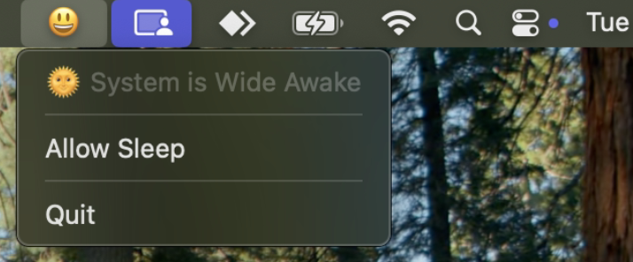
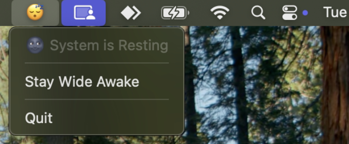

# WideAwake 😃

A lightweight macOS menu bar app that prevents your system from going to sleep - no more wiggling the mouse during long downloads, presentations, or remote sessions.

## What it does

WideAwake sits in your menu bar and toggles macOS sleep prevention via `pmset` ([`man pmset`](https://ss64.com/mac/pmset.html)).

Click the icon to see the current state and switch between **Wide Awake** (sleep disabled) and **Resting** (normal sleep behaviour).

<div align="center">

| State | Icon | Description |
|-------|------|-------------|
| Wide Awake | 😃 | Sleep is disabled — system stays on |
| Resting | 😴 | Normal sleep behaviour restored |




</div>

Toggling sleep requires administrator privileges; macOS will prompt you automatically.

## How it works

WideAwake polls `pmset -g` every 5 seconds to reflect the true system state, and uses AppleScript (`osascript`) to run `pmset -a disablesleep` with elevated privileges when toggling.

> [!NOTE]
> This project uses `uv` for dependency management and running scripts.
>
> Get it with `curl -LsSf https://astral.sh/uv/install.sh | sh` or see the [uv docs](https://docs.astral.sh/uv/).

## Getting Started

Try it out
```bash
uv run https://raw.githubusercontent.com/boonhapus/wide-awake/main/src/wide_awake/awake.py
```

To manage the app (configure as a launch agent):

```bash
git clone https://github.com/boonhapus/wide-awake.git
cd wide-awake
uv run .scripts/setup.py --help
```
